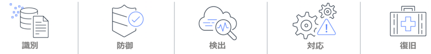

# AWS セキュリティワークショップ

AWS セキュリティワークショップポータルへようこそ! ここには、サービスエコシステムの理解に役立てるためのワークショップのコレクションがあり、AWS で実行される環境および ワークロードの保護に適用できる様々なベストプラクティスを紹介しています。 TEST

Security and Compliance is a <a href="https://aws.amazon.com/compliance/shared-responsibility-model/" target="_blank">shared responsibility</a> between AWS and the customer.  AWS customers benefit from a data center and network architecture built to satisfy the requirements of the most security-sensitive organizations.  AWS is responsible for protecting the infrastructure which runs all of the services offered and this responsibility is known as the ***Security of the Cloud***.  Customers responsibility, known as the ***Security in the Cloud***, is determined by which services the customer chooses to use.  

The workshops contained in this portal are focused on the ***Security in the Cloud*** and they will guide you through prepared scenarios that represent common use cases and operational tasks you'll face in building on AWS.  They will also highlight the design principals from the <a href="https://d1.awsstatic.com/whitepapers/architecture/AWS-Security-Pillar.pdf" target="_blank">AWS Well-Architected Framework Security Pillar</a>, which can help you improve your security posture.

* *強固な ID 基盤の実装*
* *Enable traceability*
* *Apply security at all layers*
* *Automate security best practices*
* *Protect data in transit and at rest*
* *Keep people away from data*
* *Prepare for security events*