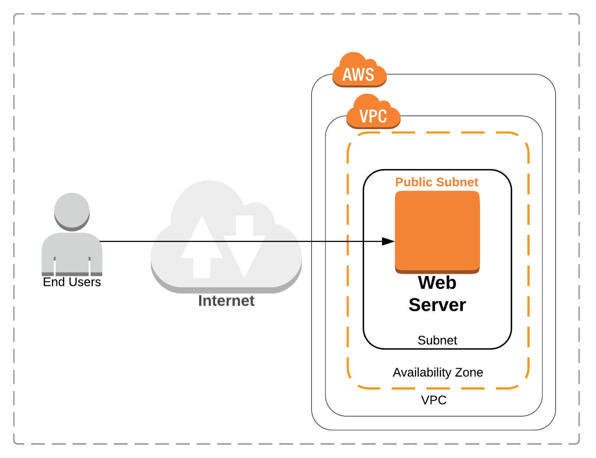

# Scaling threat detection and response on AWS

This workshop is designed to help you get familiar with AWS Security services and learn how to use them to identify and remediate threats in your environment.  You'll be working with services such as Amazon GuardDuty, Amazon Macie, Amazon Inspector, Amazon CloudWatch, AWS Lambda, AWS Systems Manager, AWS Config, and AWS CloudTrail. You will learn how to use these services to investigate threats during and after an attack, set up a notification and remediation pipeline, and  add additional protections to improve the security posture of your environment.

* **Level**: Intermediate
* **Duration**: 2 - 3 hours
* **CSF Functions**: Detect, Respond, Recover
* **CAF Components**: Detective, Responsive
* **Prerequisites**: AWS Account, Admin IAM User

## Scenario

Your company is new to the cloud and has recently performed a lift-and-shift of your infrastructure for piloting purposes.  You are a systems administrator and have been tasked with security monitoring within your AWS environment.  As part of that maintenance you are also responsible for responding to any security event in your environment.

## Architecture overview

For this Workshop you will have a single instance setup in the us-west-2 region. As this was a “lift-and-shift” migration for piloting, you have yet to build redundancy into your application, so you have a single public-facing web server. The web server has access to the Internet Gateway through an Elastic Network Interface. Customers access your web server through a DNS entry pointing to the Elastic Network Interface. You store static content in an S3 bucket and use the VPC S3 Endpoint Gateway for access from the web server.

## Presentation deck
[Workshop Presentation Deck](./threat-detect-workshop-presentation.pdf)

## Region
Please use the **us-west-2 (Oregon)** region for this workshop.

## Modules
1. [Environment Build and Configuration](./01-environment-setup.md)
2. [Attack Simulation](./02-attack-simulation.md) 
3. [Detection and Remediation](./03-detection-and-remediation.md) 
4. [Review and Discussion](./04-review-and-discussion.md)

> Total time: &plusmn; 2 hours
